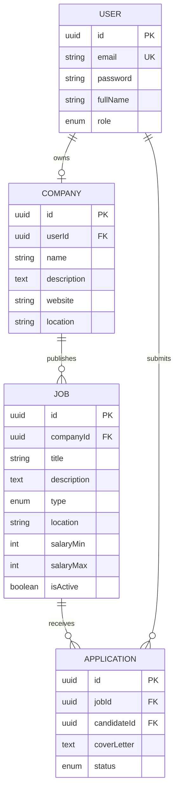

<div align="center">

# Qadem

**A jobs and internships platform built for the Palestinian tech market.**

Companies publish openings. Candidates apply and follow every application from sent to decided — in one place.

[](https://nestjs.com)
[](https://www.typescriptlang.org)
[](https://www.postgresql.org)
[](https://nextjs.org)
[](https://www.docker.com)

</div>

---

## About

Qadem was built during a backend engineering internship at **Wahj**, a Palestinian software company based in Hebron. The brief was to design and build a production-grade REST API with NestJS, TypeScript and PostgreSQL. We took it further and shipped a full product — API, database and web client.

The name comes from **قدّم** (to apply) and **قادم** (what comes next). It carries both sides of what the platform does.

---

## The problem

A graduate applies to forty openings and hears back from three. They never learn why. Was the application read? Was it ever opened? Did the role close?

Qadem makes the state of every application explicit. Nobody is left guessing.

---

## Features

### For candidates

| Feature | Description |
|---|---|
| Browse without an account | The full board is public. Sign up only when you are ready to apply. |
| Search and filter | By title, city, employment type and salary range. |
| Apply once per role | The platform enforces one application per opening at the database level. |
| Track every application | Four explicit states, visible from the moment you hit send. |

### For companies

| Feature | Description |
|---|---|
| Public company profile | Name, description, location and website — shown next to every role. |
| Publish and manage roles | Full-time, part-time or internship. Edit any detail at any time. |
| Pause instead of delete | Take a role off the board without losing its applications. |
| Review applicants | See everyone who applied and move them through your pipeline. |
| Strict ownership | A company can only ever touch its own postings. |

---

## The application lifecycle

Every application carries one of four states. Colour and label work together, so the state reads at a glance and stays readable for colour-blind users.

```
   SUBMITTED  ──▶  REVIEWING  ──▶  ACCEPTED
                        │
                        └────────▶  REJECTED
```

| State | Meaning |
|---|---|
| **Submitted** | Reaches the company the moment it is sent. |
| **Reviewing** | Opened, and being read. |
| **Accepted** | Moved forward. The company will reach out. |
| **Rejected** | Not this time — but no longer a question mark. |

---

## Data model



---

## Screenshots

> Add your screenshots to `docs/screenshots/` and they will render here.

| Landing | Job board |
|---|---|
|  |  |

| Company dashboard | Application pipeline |
|---|---|
|  |  |

---

## Built with

**Backend** — NestJS, TypeScript, TypeORM, PostgreSQL, Passport JWT, bcrypt, class-validator, Swagger

**Frontend** — Next.js (App Router), TypeScript, Tailwind CSS

**Infrastructure** — Docker Compose, pgAdmin

---

## Security

Security was treated as a design constraint, not an afterthought.

**Passwords and refresh tokens are both hashed** with bcrypt and excluded from queries by default — they are only ever loaded when explicitly requested.

**Access and refresh tokens are signed with separate secrets**, so one can never be used in place of the other. Refresh tokens rotate on every use.

**Endpoints are protected by default.** Public routes are the explicit exception, so a forgotten decorator fails closed rather than open.

**Role and ownership are separate checks.** Being a company grants access to the company endpoints; owning a posting is verified independently before any edit or delete.

**Responses are shaped by DTOs**, never by entities — internal fields cannot leak by accident when the schema changes.

---

## API documentation

Interactive Swagger documentation is generated from the code and available at `/api/docs` when the server is running.

---

## Team

Built by **Hosam Tarade** and **Mohammad Tarada** during a backend engineering internship at Wahj.

---

<div align="center">
<sub>Built in Palestine.</sub>
</div>