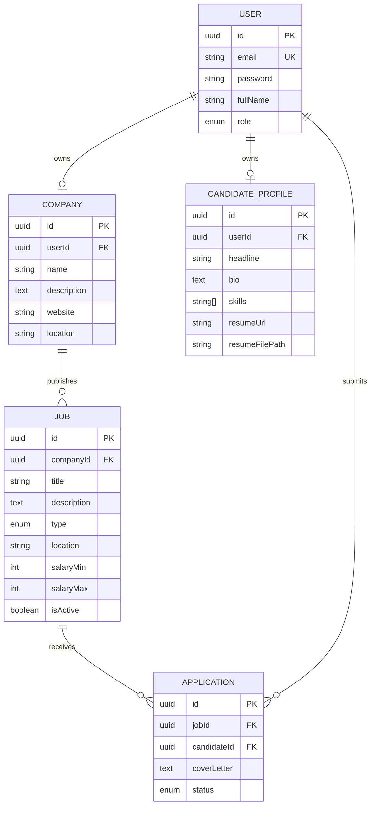

<div align="center">


**A jobs and internships platform built for the Palestinian tech market.**

Companies publish openings. Candidates apply and follow every application from sent to decided — in one place.

[](https://nestjs.com)
[](https://www.typescriptlang.org)
[](https://www.postgresql.org)
[](https://nextjs.org)
[](https://www.docker.com)

</div>

---

## About

Qadem was built during a backend engineering internship at **Wahj**, a Palestinian software company based in Hebron. The brief was to design and build a production-grade REST API with NestJS, TypeScript and PostgreSQL. We took it further and shipped a full product — API, database and web client.

The name comes from **قدّم** (to apply) and **قادم** (what comes next). It carries both sides of what the platform does.

---

## The problem

A graduate applies to forty openings and hears back from three. They never learn why. Was the application read? Was it ever opened? Did the role close?

Qadem makes the state of every application explicit. Nobody is left guessing.

---

## Features

### For candidates

| Feature | Description |
|---|---|
| Browse without an account | The full board is public. Sign up only when you are ready to apply. |
| Search and filter | By title, city, employment type and salary range. |
| Candidate profile | Headline, bio, skills, experience, contact and social links. |
| Resume | Upload a file (PDF/DOC/DOCX) or link to an external resume — or both. |
| Apply once per role | The platform enforces one application per opening at the database level. |
| Track every application | Four explicit states, visible from the moment you hit send. |

### For companies

| Feature | Description |
|---|---|
| Public company profile | Name, description, location and website — shown next to every role. |
| Publish and manage roles | Full-time, part-time or internship. Edit any detail at any time. |
| Pause instead of delete | Take a role off the board without losing its applications. |
| Review applicants | See everyone who applied, along with their profile and resume. |
| Update application status | Move applicants through Submitted → Reviewing → Accepted/Rejected. |
| Strict ownership | A company can only ever touch its own postings and applicants. |

---

## The application lifecycle

Every application carries one of four states. Colour and label work together, so the state reads at a glance and stays readable for colour-blind users.

```
   SUBMITTED  ──▶  REVIEWING  ──▶  ACCEPTED
                        │
                        └────────▶  REJECTED
```

| State | Meaning |
|---|---|
| **Submitted** | Reaches the company the moment it is sent. |
| **Reviewing** | Opened, and being read. |
| **Accepted** | Moved forward. The company will reach out. |
| **Rejected** | Not this time — but no longer a question mark. |

Status transitions are enforced by the API: a decided application (Accepted/Rejected) cannot be moved back.

---

## Data model



---

## Built with

**Backend** — NestJS, TypeScript, TypeORM, PostgreSQL, Passport JWT, bcrypt, class-validator, Swagger, Multer (file uploads)

**Frontend** — Next.js (App Router), TypeScript, Tailwind CSS

**Infrastructure** — Docker Compose, pgAdmin, GitHub Actions

---

## Security

Security was treated as a design constraint, not an afterthought.

**Passwords and refresh tokens are both hashed** with bcrypt and excluded from queries by default — they are only ever loaded when explicitly requested.

**Access and refresh tokens are signed with separate secrets**, so one can never be used in place of the other. Refresh tokens rotate on every use.

**Endpoints are protected by default.** Public routes are the explicit exception, so a forgotten decorator fails closed rather than open.

**Role and ownership are separate checks.** Being a company grants access to the company endpoints; owning a posting is verified independently before any edit, delete, or applicant view.

**Duplicate applications are blocked at the database level** — not just in application code — via a unique constraint on (candidateId, jobId).

**Responses are shaped by DTOs**, never by entities — internal fields cannot leak by accident when the schema changes.

**Uploaded resumes are stored outside the public path** and only served through an authenticated, ownership-checked endpoint.

---

## Getting Started

### Prerequisites
- Node.js 24+
- PostgreSQL 16+
- npm

### Installation

```bash
git clone <repo-url>
cd Qadem_Platform/backend
npm install
```


```

### Database Setup

```bash
npm run migration:run
```

### Run the App

```bash
npm run start:dev
```

API runs at `http://localhost:3001/api`

---

## API Documentation

Interactive Swagger documentation is generated from the code and available at `/api/docs` when the server is running:

```
http://localhost:3001/api/docs
```

---

## Testing

The project includes end-to-end (e2e) tests covering the critical business logic — the parts of the system where a silent bug would matter most:

- **Duplicate application prevention** — a candidate cannot apply twice to the same job.
- **Job ownership** — a company can only edit, delete, or view applicants for its own postings.
- **Role restrictions** — candidates cannot publish jobs; companies cannot apply to them.
- **Status transitions** — a decided application cannot be moved back to a previous state.

### Run Tests Locally

```bash
npm run test:e2e
```

> Requires Node 24+ (Jest's native ESM support) and a running PostgreSQL instance. Running the suite clears the `applications`, `candidate_profiles`, `jobs`, `companies` and `users` tables — re-seed afterwards with `npm run seed` if needed.

### Continuous Integration

Tests run automatically on every `push` and `pull_request` to `main` via **GitHub Actions**. The workflow:

1. Spins up a temporary PostgreSQL service container
2. Installs dependencies with the exact locked versions
3. Runs database migrations
4. Runs the full e2e test suite

Workflow file: `.github/workflows/backend-tests.yml`

Results are visible under the **Actions** tab on GitHub — every push gets a pass/fail signal without anyone needing to run tests manually.

---

## API Testing with Postman

A ready-to-use Postman collection is included for manual, exploratory API testing, complementing the automated e2e suite.

### Import Steps
1. Open Postman
2. Click **Import**
3. Select `Qadem-API.postman_collection.json` (located in `backend/docs/`)
4. Create an Environment with:
   - `baseUrl` = `http://localhost:3001`
   - `accessToken` = *(leave empty — filled in after login)*

### Suggested Flow
1. `POST /api/auth/register` → create an account
2. `POST /api/auth/login` → get `accessToken`, save it to the environment variable
3. Use protected endpoints (jobs, applications, profiles) with the saved token

---

## Team

Built by **Hosam Tarade** and **Mohammad Tarade** during a backend engineering internship at Wahj.

---

<div align="center">
<sub>Built in Palestine.</sub>
</div>